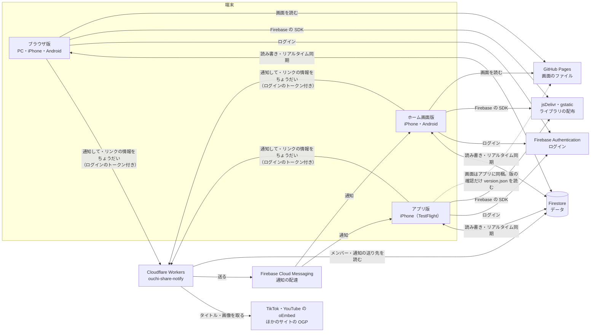

# 構成（使っているサービス・お金・データの流れ）

サービスを足す・やめる・プランを変える・設定値を変えたら、このファイルを直す（CLAUDE.md の決まり）。
アプリの中の作り（画面・データ構造）は [design.md](design.md)、端末ごとの違いは [CLAUDE.md](../CLAUDE.md) の「対応する環境」。

最終更新: 2026-10-10

## 全体の図

## サービスの一覧

| サービス | 何に使うか | プラン・費用 | 管理する場所 | リポジトリの中の設定 |
|---|---|---|---|---|
| **GitHub** | ソースコード、Web 版の公開（GitHub Pages） | 無料 | GitHub のユーザー `flyaway2525`、リポジトリ `ouchi-share` | リポジトリ直下のファイルがそのまま公開される（ビルドなし） |
| **Firebase**（Google） | ログイン（Authentication：Google・匿名（ゲスト）・Apple）、データ（Firestore、東京リージョン `asia-northeast1`）、通知の配達（Cloud Messaging） | Spark（無料）。超えても課金されず、その日は止まる | Firebase コンソールのプロジェクト `ouchi-share` | `js/firebase.js`（公開してよい設定値・VAPID キー）、`firestore.rules`、`firebase.json`、`.firebaserc`、`ios/App/App/GoogleService-Info.plist` |
| **Google Analytics（GA4）** | アクセスの計測（画面の種類ごとの表示回数・利用者数など）。ブラウザ版・ホーム画面版だけ（アプリ版はプラグインを入れてから） | 無料 | Firebase コンソール → プロジェクトの設定 → 統合 → Google Analytics と、Google Analytics の画面 | `js/analytics.js`、測定 ID は `js/firebase.js` の measurementId |
| **Cloudflare Workers** | 通知を送る（`POST /`）、リンクのタイトルと画像を取る（`POST /preview`）、アプリ開発者の管理（`POST /admin`：グループ・ユーザーの削除、ユーザーの停止＝ログインのアカウントを無効にする）、本人のアカウントの削除（`POST /account`。App Store の決まり）、壁紙のおすそわけ（`POST /wallpaper`・`/wallpaper/upload`。KV `WALLPAPERS` に 7 日間だけ置く）、毎日 20 時（日本時間）の翌日の予定のリマインド | 無料（1 日 10 万リクエストまで） | Cloudflare のアカウント（workers.dev のサブドメイン `flyaway2525`）、Worker `ouchi-share-notify` | `worker/`（`wrangler.toml` に定期実行の時刻）。URL は `js/firebase.js` の `NOTIFY_URL` |
| **Apple** | iPhone アプリ版（Xcode でビルド → TestFlight で配る）、Apple でサインイン、アプリの通知（APNs。これから） | Apple Developer Program 年 99 ドル（有効。チーム ID `YGJ84959MM`。2026-10-09 に TestFlight へのアップロードを確認） | Apple Developer・App Store Connect | `ios/`、`capacitor.config.json`（アプリ ID `io.github.flyaway2525.ouchishare`） |

### 外から読み込んでいるもの（アカウント不要・無料）

| 読み込み先 | 何を | どこから |
|---|---|---|
| `www.gstatic.com/firebasejs/12.19.0/` | Firebase の SDK | `js/firebase.js`・`js/store.js`・`js/auth.js`・`js/push.js` |
| `www.gstatic.com/firebasejs/12.19.0/firebase-analytics.js`・`www.googletagmanager.com` | GA4 の計測（最初の画面のあとで読み込む） | `js/analytics.js` |
| `cdn.jsdelivr.net`（qrcode-generator 2.0.4） | QR コードを作るライブラリ（必要なときだけ） | `js/ui.js` の `qrCode` |
| `fonts.googleapis.com`・`fonts.gstatic.com`（Google Fonts） | 着せ替えのフォント（その着せ替えを使うとき・見本を出すときだけ） | `js/skins.js` の `loadFont` |
| TikTok・YouTube の oEmbed、各サイトのページ | リンクのタイトル・画像 | Cloudflare Workers の `/preview`（アプリから直接は読まない） |

## 秘密の値・公開してよい値

| 値 | 公開してよいか | 置き場所 |
|---|---|---|
| Firebase の設定値（apiKey など）・VAPID の公開鍵 | よい（ルールで守る前提の値） | `js/firebase.js` |
| Firebase のサービスアカウントキー | **だめ** | Cloudflare の秘密の値 `FIREBASE_SERVICE_ACCOUNT`（`npx wrangler secret put`）だけ。リポジトリ・会話には出さない。登録はユーザーが行う |
| 管理者の許可リスト | uid だけ（メールアドレスは載せない） | Firestore の `admins/{uid}`（コンソールから手で追加）。`developer: true` ならアプリ開発者。いつもの開発者の uid は `DEVELOPER_UIDS`（js/firebase.js・firestore.rules・worker/src/index.js） |

## 公開・反映のしかた

| 何を | コマンド | どこで |
|---|---|---|
| Web 版 | `node scripts/bump-version.mjs "変更の内容"` → コミット → `git push`（数分で GitHub Pages に反映） | Windows（いつもの作業場所） |
| Firestore のルール | `firebase deploy --only firestore:rules` | Windows |
| Cloudflare Workers | `worker/` で `npx wrangler deploy` | Windows |
| iPhone アプリ版 | `APPLE_TEAM_ID=… scripts/ios-testflight.sh`（ios:sync → Archive → App Store Connect へアップロード。手順は [ios-setup.md](ios-setup.md)） | Mac（MacBook Pro 2018・Xcode 26.3） |

## 無料枠の目安（家族で使う分には十分）

| サービス | 無料枠 | 気にするところ |
|---|---|---|
| Firestore（Spark） | 1 日：読み取り 5 万・書き込み 2 万・削除 2 万。保存 1GiB | オンライン表示の記録（1 人 1 分に 1〜2 回）、写真（縮小した JPEG を Firestore に保存） |
| Cloudflare Workers | 1 日 10 万リクエスト | 通知とリンクの取得には 1 人ごとの回数の上限を入れてある |
| Cloudflare Workers KV | 保存 1GB・1 日に読み取り 10 万・書き込み 1,000 | 壁紙のおすそわけ（1 件 20MB まで・1 グループ 20 件まで・7 日で自動で消える） |
| Cloud Messaging | 無料 | — |
| GitHub Pages | 公開サイト 1GB・月 100GB の転送（目安） | — |

## お金

- かかるのは **Apple Developer Program の年 99 ドルだけ**。ほかに有料のサービス・プランは使わない（Firebase は Blaze にしない）
- 有料のものが必要になりそうなときは、先にユーザーに相談する
- お問い合わせは **Google フォーム**（無料。ユーザーの Google アカウントで作った「おうちでシェア お問い合わせ」。回答はフォームの「回答」に、新しい回答はメールで通知）。アプリの設定の画面からは、版（entry.1638365749）と端末（entry.1808333484）を入れて開く。よくある質問は GitHub Pages の `support.html`（App Store のサポート URL）
- 利用規約・プライバシーポリシーは GitHub Pages の `terms.html`・`privacy.html`（アプリ版は公開中のページを開く。App Store に URL を登録する）。App Store に入力する内容の下書きは [app-store.md](app-store.md)
- 有料プラン（無料・👑 サブスク・💎 買い切りの 3 段。公式の着せ替え）の方針を 2026-10-10 に決めた（docs/design.md の「有料プランの方針」）。まだ作っていない。課金を入れるときは、App Store のアプリ内課金（Small Business Program で手数料 15%）と、使う人が増えたときの Firebase の Blaze（予算の上限付き）・Cloudflare Pages への移動を、あらためて相談する
